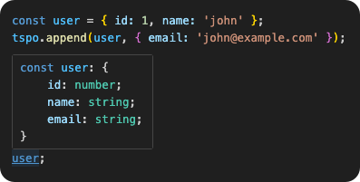

# 🟦 tspo

[](https://www.npmjs.com/package/tspo)
[](https://www.npmjs.com/package/tspo)
[](https://www.npmjs.com/package/tspo)
[](https://bundlephobia.com/package/tspo)
[](LICENSE)

> `tspo (TypeScript Plain Object)` is a collection of utilities for handling both runtime and compile-time behavior for plain-objects.

<p align="center">
  
</p>

## 🤔 What is a plain-object?

A _plain-object_ in JavaScript is any object which inherits directly from the base `Object` class and no other, or is created through `Object.create(null)` (aka _null-prototype object_). TypeScript technically has no concept of plain-object so we'll consider a TypeScript plain-object as any JavaScript plain-object whose type is `Record<PropertyKey, unknown>`. Another important term to note is _Dictionary_, which is often used interchangeably with plain-object. A _Dictionary_ is a plain-object whose type has been narrowed to `Record<string, unknown>`. In JavaScript, numbers are converted to strings when added as object-keys and `Symbols` are rarely used outside of creating libraries so differentiating the two is rarely important, **BUT** to prevent ambiguity we'll distinguish them here.

3 ways to implement:

- **object-literals:** (most-common), i.e `var user = { id: 1, name: 'john' }`
- **Object constructor:** `var user = new Object()`
- **null-prototype objects:** `var user = Object.create(null)`

> _object-literals_ and _instances of Object_ will inherit from the base _Object_ class; hence, they can use methods like `.hasOwnProperty`. _null-prototype objects_ inherit from nothing so cannot use these functions.

## ❓Why tspo?

- Small, zero-dependency utility set centered around plain-object workflows.
- Avoid having to manually create new types for different object shapes.
- Runtime AND type-level safety in the same API surface.
- Mutating utilities with assertion-based type refinement.
- All complex-types collapsed for better IntelliSense.

## 📦 Installation

```bash
npm install tspo
```

```bash
pnpm add tspo
```

```bash
yarn add tspo
```

## ⚡ Quick start

```ts
import tspo from 'tspo';

const user = {
  id: 1,
  name: 'Ada',
  email: 'ada@e.com',
} as const;

// Non-mutating functions
tspo.omit(user, 'email'); // => { id: 1, name: "Ada" }
tspo.pick(user, 'name'); // => { name: "Ada" }
tspo.merge({ id: 1 }, { name: 'Ada' }); // => { id: 1, name: "Ada" }

// Accessors
tspo.safeIndex(user, 'someString'); // 'id' | 'name' | 'email'
```

## 📚 API Summary

Use this as a quick decision guide:

### Object builders

| Function                    | Notes                                        |
| --------------------------- | -------------------------------------------- |
| [`omit`](#omit)             | Returns object without selected keys         |
| [`pick`](#pick)             | Returns object with selected keys            |
| [`merge`](#merge)           | Returns `{...a, ...b}`                       |
| [`mergeArray`](#mergearray) | Merge an array of objects to a single object |
| [`addEntry`](#addentry)     | Adds one `[key, value]` entry                |
| [`addEntries`](#addentries) | Adds multiple `[key, value]` entries         |

### Mutators

| Function            | Notes                                        |
| ------------------- | -------------------------------------------- |
| [`append`](#append) | Merge one object into the original reference |
| [`remove`](#remove) | Deletes keys and refines deletes to `never`  |

### Indexing

| Function                                | Notes                                           |
| --------------------------------------- | ----------------------------------------------- |
| [`index`](#index)                       | Dynamic lookup, returns `undefined` when absent |
| [`safeIndex`](#safeindex)               | Lookup that throws on missing key               |
| [`reverseIndex`](#reverseindex)         | Returns all matching keys for a value           |
| [`safeReverseIndex`](#safereverseindex) | Returns exactly one key or throws               |

### Validator functions

| Function              | Notes                                            |
| --------------------- | ------------------------------------------------ |
| [`is`](#is)           | Runtime plain-object guard                       |
| [`isKey`](#iskey)     | Type guard for existing key                      |
| [`isValue`](#isvalue) | Type guard for existing value                    |
| [`isDict`](#isdict)   | Narrow plain-object to `Record<string, unknown>` |

### Collections

| Function                    | Notes                                   |
| --------------------------- | --------------------------------------- |
| [`keys`](#keys)             | Typed `Object.keys` tuple               |
| [`values`](#values)         | Typed `Object.values` tuple             |
| [`entries`](#entries)       | Typed `Object.entries` tuple            |
| [`firstEntry`](#firstentry) | First entry in object enumeration order |

### Utilities

| Function              | Notes                             |
| --------------------- | --------------------------------- |
| [`iterate`](#iterate) | Recursive walks over nested TSPOs |
| [`copy`](#copy)       | Deep clone utility                |
| [`compare`](#compare) | Deep compare utility              |

## 📖 API reference

### Object builders

Due to performance reasons, most of the time you should use JavaScript's built-in _merge_ and _spread_ operations. However, the following Object builders may provide better ergonomics in certain scenarios.

As you can see in the following example, with `.pick` we can create our new object in one line without generating unused variables.
```ts
// Using spread
const setupUserView(user: IUser): UserView {
  const { id, name, email, ...other } = user,
    userView: UserView = { id, name, email };
  ...do stuff
}

// Using tsgo.pick
const setupUserView(user: IUser): UserView {
  const userView = tsgo.pick(user, ['id', 'name', 'email']);
  ...do stuff
}
```

> What about **lodash.pick**? If you're using lodash you probably don't need **tsgo**; however, lodash is pretty bloated while **tsgo** focuses on plain-objects. 

<a id="omit"></a>

#### `.omit(T: object, K: keyof T | Array<keyof T>): Omit<T, K>`

Returns a new object excluding one key or an array of keys.

```ts
const redacted = tspo.omit({ a: 'a', b: 1, c: false }, ['b', 'c']);
// Value: { a: 'a' }
// Type:  { a: string; }
```

<a id="pick"></a>

#### `.pick(T: object, K: keyof T | Array<keyof T>): Pick<T, K>`

Returns a new object containing only one key or an array of keys.

```ts
const preview = tspo.pick({ a: 'a', b: 1, c: false }, ['a', 'c']);
// Value: { a: 'a', c: false }
// Type:  { a: string; c: boolean }
```

<a id="merge"></a>

#### `.merge(T: object, U: object): T & U`

Returns a new object from `{ ...a, ...b }` with merged typing.

```ts
const full = tspo.merge({ id: 1 }, { active: true });
// Value: { id: 1; active: true }
// Type:  { id: number; active: boolean }
```

<a id="mergearray"></a>

#### `.mergeArray(T: object[]): { ...T }`

Returns a new object with every item from `T` merged into a single object. Note that if there's a conflict for the keys, value types will become unions.

```ts
const full = tspo.mergeArray([
  { id: 1, name: 'john' },
  { id: '1', active: true },
]);
// Value: { id: '1'; name: 'john', active: true }
// Type:  { id: string | number; name: string; active: boolean }
```

<a id="addentry"></a>

#### `.addEntry(T: object, entry: [K, V]): T & { K: V }`

Returns a new object by adding a single entry to `T`.

```ts
const draft = { id: 1 };
const newDraft = tspo.addEntry(draft, ['team', 'platform']);
// Value: { id: 1, team: 'platform' }
// Type:  { id: number; team: string }
```

<a id="addentries"></a>

#### `.addEntries(T: object, entries: [K, V][]): T & { [P in K]: V }`

Returns a new object by adding multiple entries to `T`. Note that if there's a conflict for the keys, value types will become unions.

```ts
const draft = { id: 1 };
const newDraft = tspo.addEntry(draft, [
  ['team', 'one'],
  ['age', 5],
  ['age', '5'],
]);
// Value: { id: 1, team: 'one', age: 5 }
// Type:  { id: number; team: string; age: string | number  }
```

### Mutators

- Functions which modify the original type/reference and return `void`.
- **DO NOT** set a return value from mutation functions or type-updating will not work.

<a id="append"></a>

#### `.append(T: object, U: object): void`

Mutates `T` by copying enumerable keys from `U`. TypeScript narrows `T` to `T & U` after the call.

```ts
const draft = { id: 1 };
tspo.append(draft, { name: 'Ada' });
// Type `draft` is now:  { id: number; name: string }
// Value: { id: 1, name: 'Ada' }
```

<a id="remove"></a>

#### `.remove(T: object, K: keyof T | Array<keyof T>): void`

Mutates `T` and deletes one or more keys.

- Because of TypeScript limitations, we cannot remove keys in place on `T` so we set them to `never`.
- If you want to clean the type after removing, use `OmitNever<T>`

```ts
const draft = { id: 1, email: 'ada@example.com' };
tspo.remove(draft, 'email');
type Clean = OmitNever<typeof draft>; // strips `never` keys
// Type `draft` is now: { id: number; email: never }
// Type `Clean`: { id: number }
// Value: { id: 1 }
```

### Indexing

These are useful when your key or value is coming from a dynamic source.

<a id="index"></a>

#### `.index(T: object, key: string | number): keyof T | undefined`

Dynamic key lookup that returns `undefined` when missing.

```ts
const value = tspo.index({ a: 'a', b: 1 }, 'a');
// Value: "a"
// Type: => 'a' | 1 | undefined
```

<a id="safeindex"></a>

#### `.safeIndex(T: object, key: string | number): keyof T`

Dynamic key lookup that _throws_ if the key does not exist.

```ts
const value = tspo.safeIndex({ a: 'a', b: 1 }, 'a');
// Value: "a"
// Type:  'a' | 1
```

<a id="reverseindex"></a>

#### `.reverseIndex(T: object, value: unknown): Array<T[keyof T]>`

Returns all keys whose value is strictly equal (`===`) to `value`.

```ts
const keys = tspo.reverseIndex({ a: 1, b: 2, c: 1 }, 1);
// Value: ["a", "c"]
// Type (Tuple-type): ['a', 'b', 'c']
```

<a id="safereverseindex"></a>

#### `.safeReverseIndex(T: object, value: unknown): T[keyof T]`

Returns exactly one matching key for `value`. Throws if zero or multiple keys match.

```ts
const key = tspo.safeReverseIndex({ a: 1, b: 2 }, 2);
// Value: "b"
// Type: 'a' | 'b'
```

### Validator functions

<a id="is"></a>

#### `.is(arg: unknown): arg is Record<PropertyKey, unknown>`

Validator-function for plain-objects.

```ts
tspo.is({ a: 1 }); // true
tspo.is(Object.create(null)); // true
tspo.is([]); // false
tspo.is(new Date()); // false
```

<a id="iskey"></a>

#### `.isKey(T: object, arg: string): arg is keyof T`

Runtime key existence check and TypeScript key guard.

```ts
const candidate: string = 'email';
if (tspo.isKey(user, candidate)) {
  // candidate is narrowed to `keyof typeof user`
}
```

<a id="isvalue"></a>

#### `.isValue(T: object, arg: unknown): arg is T[keyof T]`

Runtime value existence check and TypeScript value guard.

```ts
const candidate: unknown = 'admin';
if (tspo.isValue(user, candidate)) {
  // candidate is narrowed to `typeof user[keyof typeof user]`
}
```

<a id="isdict"></a>

#### `.isDict(arg: unknown): arg is Record<string, unknown>`

Similar to `.is` above but narrows the keys to just strings. At runtime is makes
sure none of the keys are symbols.

```ts
tspo.isDict({ a: 1 }); // true
tspo.isDict(Object.create(null)); // true
tspo.isDict({ [Symbol('foo')]: 'bar' }); // false
```

### Collections

<a id="keys"></a>

#### `.keys(T: object): Tuple of keyof T`

Typed `Object.keys`. Tuple order not guaranteed.

```ts
const keys = tspo.keys({ a: 1, b: 2, c: 1 });
// Value: ["a", "b", "c"]
// Type (Tuple-type): ['a', 'b', 'c']
```

<a id="values"></a>

#### `.values(T: object): Tuple of T[keyof T]`

Typed `Object.values()`. Tuple order not guaranteed.

```ts
const allValues = tspo.values({ a: 1, b: 2, c: 1 });
// Value: [1, 2, 3]
// Type (Tuple-type): [1, 2, 3]
```

<a id="entries"></a>

#### `.entries(T: unknown): Tuple of [keyof T, T[keyof T]]`

Typed `Object.entries`. Tuple order not guaranteed.

```ts
const allEntries = tspo.entries(user);
// Value: [["a", 1], ["b", 2], ["c", 3]]
// Type (Tuple-type): [['a', 1], ['b', 2], ['c', 3]]
```

<a id="firstentry"></a>

#### `.firstEntry(arg: object): [keyof T, T[keyof T]]`

Returns the first entry by object enumeration order.

> This is useful when you know your object only has one entry but you don't know the `key` value. Passing one key/value pair of an object to a function is a common pattern when updating objects in TypeScript.

```ts
const [key, value] = tspo.firstEntry({ id: 1 });
// Value: ["id", 1]
// Type: ["id", number]
```

### Utilities

<a id="iterate"></a>

#### `.iterate(root: object | array, cb: "See Callback below"): void`

Recursively iterates a plain-object (and nested plain-objects/arrays) and fires a callback for every key before descending. Any object other than a plain-object or array IS NOT descended into.

`Callback, (arg: { ...parameters }) => void`:

| Parameter | Type                      | Description                                  |
| --------- | ------------------------- | -------------------------------------------- |
| `parent`  | `object \| Array`         | Object or array containing the current entry |
| `key`     | `string \| number`        | Key/index on `parent`                        |
| `value`   | `unknown`                 | Entry value                                  |
| `path`    | `Array<string \| number>` | Path to `parent` from root                   |

```ts
tspo.iterate(
  {
    user: { id: 1, name: 'Ada' }, // callback fires, then recursion enters `user`
    flags: ['staff'], // callback fires, then recursion enters `flags`
    foo: new Set(), // callback fires (non-recursive value)
  },
  ({ key, value, path }) => {
    // fires for:
    // user      -> path: []
    // user.id   -> path: ['user']
    // user.name -> path: ['user']
    // flags     -> path: []
    // flags[0]  -> path: ['flags']
    // foo       -> path: []
    console.log(path, key, value);
  },
);
```

<a id="copy"></a>

#### `.copy(T: object, options?: "See Options Table Below"): T`

Deep-clones a plain-object value but (by default) recursion only steps into nested plain-objects and arrays:

- Primitives/functions copied by value
- Nested `Date` values are copied by epoch and new `Date` instances are returned.
- Nested objects other than plain-objects/arrays (i.e. `Set/Map`) are only _shallow-cloned_.
- With `options` some of this behavior can be overriden.

| Option         | Type      | Default | Description                                                       |
| -------------- | --------- | ------- | ----------------------------------------------------------------- |
| `resetDates`   | `boolean` | `false` | Resets all nested `Date` values to the current time.              |
| `deepCloneAll` | `boolean` | `false` | Deep-clones all nested object values not just plain-object/arrays |

> `.copy` is much faster than `structuredClone` with `deepCloneAll: false`, so is recommended when you don't need deep-cloning for anything other than plain-objects/arrays.

```ts
const snapshot = tspo.copy({
  id: 1,
  birthdate: new Date(), // `birthdate` -> new Date() of same epoch
  address: {
    // `address` -> deep-cloned
    street: '123 fake st',
    city: 'seattle',
    country: {
      name: 'USA',
      code: 1,
    },
  },
  jobHistory: [
    // `jobHistory` -> deep-cloned
    'janitor',
    {
      company: 'Lowes',
      role: 'sales associate',
      otherRoles: new Set(['fork-lift driver', 'cashier']), // -> `otherRoles` shallow-cloned (by default)
    },
  ],
});
```

<a id="compare"></a>

#### `.compare(T: object, U: object): boolean`

Recursively compares 2 plain-objects but only arrays and plain-objects will be stepped into.

- `Date` objects will be compared by the epoch
- Nested objects, other than arrays/plain-objects, will be compared by reference.

> `.compare` isn't recommended if you have nested objects other than plain-objects/arrays/Dates. Works great for the vast majority of real-world comparisons though.

```ts
const currentDate = new Date();
const jobs = new Set(['janitor']);
const jobs2 = new Set(['janitor']);

const user = {
  id: 1,
  birthdate: currentDate,
  jobs: jobs,
};

const user2 = {
  id: 1,
  birthdate: currentDate,
  jobs: jobs,
};

const user3 = {
  id: 1,
  birthdate: currentDate,
  jobs: jobs2,
};

tspo.compare(user, user2); // true;
tspo.compare(user, user3); // false;
```

## 📄 License

MIT © [seanpmaxwell1](LICENSE)
